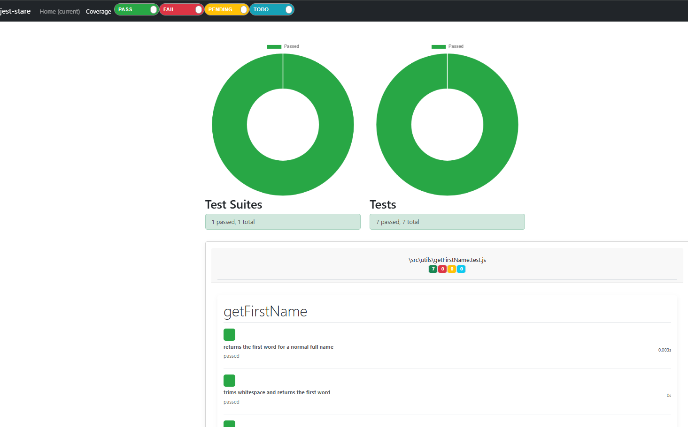

# Meatbag

Working on NextAuth in this iteration.

---

## Linting & Formatting

### Run ESLint

- Lint your codebase:
  ```sh
  npx eslint .
  ```
- Print your ESLint config:
  ```sh
  npx eslint --print-config .eslintrc.mjs
  ```
- [Next.js ESLint Docs](https://nextjs.org/docs/app/api-reference/config/eslint)

- Add the ESLint extension to your editor to see squigglies for the rules in .eslintrc.mjs

### Run Prettier

- Format your entire codebase:
  ```sh
  npx prettier --write .
  ```
- (Optional) For explicit file types, consider this future script in `package.json`:
  ```json
  "format": "prettier --write \"**/*.{js,jsx,ts,tsx,mjs,cjs,json,css,md}\""
  ```
- Add the Prettier extension to your editor for best experience.

---

## Unit Testing

Unit testing is set up using Jest, Babel, React Testing Library, and Jest-Stare for reporting.
The configuration can be found in `jest.config.js`, and best practices are documented in
`UNIT_TESTING_BEST_PRACTICES.md`.

### Key Packages

- `jest` & `jest-environment-jsdom`: Core test runner and DOM simulation
- `babel-jest`, `@babel/preset-env`, `@babel/preset-react`: Transpile modern JS/JSX for tests
- `@testing-library/react`, `@testing-library/jest-dom`: User-centric React component testing
- `jest-stare`: Generates HTML reports and visualizes test coverage
- `identity-obj-proxy`: Mocks CSS modules for component tests

### Running Tests & Viewing Coverage

- Run all tests and generate a coverage report: `npm run test:html`
- Open `jest-stare/index.html` for a visual summary of test results and coverage

### What We Test (Primarily)

- **Critical business logic** (e.g., utility functions, calculation modules)
- **Critical UI components** (e.g., authentication forms, navigation, error boundaries)
- **Authentication logic** (e.g., sign-in, sign-out, session management)
- **Pages with significant logic** (e.g., dashboard, profile, or any page with complex state)
- **Decision points** (e.g., branching logic, error handling, edge cases)

### Test Coverage Emphasis

- Ensure all major decision points and critical flows are covered
- Focus on both "happy path" and edge/error cases
- Strive for high coverage in core app logic and user-facing components

### Example Jest-Stare Report

See below for a sample of the kind of report Jest-Stare provides.



### Core Unit Testing Best Practices (Simplified)

- Test only the public contract (inputs/outputs, not internals)
- Cover typical, boundary, and invalid cases
- Simulate user interactions for UI components
- Mock external dependencies and side effects
- Isolate tests for clarity and maintainability
- Write one clear assertion per test
- Add regression tests for bugs
- Avoid testing implementation details or third-party internals

---

#### Test Coverage Types Explained (JavaScript/React/Next.js)

**% of Statements**

- Measures the percentage of all executable statements run by tests.
- In JS/React/Next, this includes variable declarations, assignments, function calls, return statements, loops, conditionals, object property access, ternary expressions, and JSX elements.
- Indicates whether test code is executing logic in your source files.

**% of Branches**

- Measures the percentage of all decision points (branches) that are executed.
- Examples: if/else, switch statements, ternary operators, logical conditions (&&, ||), optional chaining.
- Shows how well tests cover conditional logic paths; requires tests for both sides of a branch.
- Strong branch coverage improves confidence across all other metrics.

**% of Functions**

- Measures the percentage of defined functions called by your tests.
- Includes named/anonymous functions, arrow functions, React component functions, and utility/helper functions.
- Functions with 0% coverage are never invoked—possible dead code or untested logic.

**% of Lines**

- Measures the percentage of individual lines of code executed.
- Similar to statement coverage, but easier to read; may differ slightly depending on tool parsing.

**Uncovered Line Numbers**

- Tools like `jest --coverage` list specific line numbers in each file that were never run during tests.
- Helps quickly locate gaps in test coverage.

---

#### Testing Stack

We are using:

- `@testing-library/react` for rendering components, simulating user interactions, and asserting expected behaviors.

---

#### TO DOs (Testing & CI/CD)

#### **Sign-In Page**

- **File:** `src/app/auth/signin/page.test.js`
- **What’s Tested:**
  - Renders logo, brand text, and "Login"/"Signup" buttons.
  - Mocks `signIn` and checks it is called with "google" when Login is clicked.
  - Mocks Next.js Image and Button.
- **Insights:**
  - Focuses on visible output and user interaction.
  - All external dependencies are mocked for isolation.

#### **AuthProvider**

- **File:** `src/app/context/AuthProvider.test.js`
- **What’s Tested:**
  - Mocks `SessionProvider` from `next-auth/react`.
  - Checks children are wrapped by the provider.
- **Insights:**
  - Only the contract and visible output are tested.
  - Includes an explanation block for future maintainers.
  - **Error/Resolution:** Always import React in `.js` files using JSX.

#### **NextAuth API Route**

- **File:** `src/app/api/auth/[...nextauth]/route.test.js`
- **What’s Tested:**
  - Mocks NextAuth and GoogleProvider.
  - Ensures environment variables are set.
  - Checks route logic with mocks.
- **Insights:**
  - No real OAuth/network calls.
  - Ensures test isolation and avoids side effects.

---

### 3. **Root Pages & Layout**

#### **Root Layout**

- **File:** `src/app/layout.test.js`
- **What’s Tested:**
  - Mocks Navbar, AuthProvider, ClientLayout, and font.
  - Asserts children and key layout components are rendered.
  - Checks font class and metadata export.
- **Insights:**
  - Focuses on contract and visible output.
  - Mocks all providers for isolation.
  - See explanation block for best practices and scope.

#### **Home Page**

- **File:** `src/app/page.test.js`
- **What’s Tested:**
  - Mocks session, navigation, Button, utility functions, CSS modules, and dummy user data.
  - Renders brand, buttons, and correct behavior based on session.
  - Simulates user interactions and navigation.
- **Insights:**
  - Comprehensive: covers rendering and user interaction.
  - All dependencies are mocked.

---

### 4. **Workout/Exercise Pages**

#### **Workout Exercise Page**

- **File:** `src/app/workout/[day]/[exercise]/page.test.js`
- **What’s Tested:**
  - Mocks CSS modules, `ExerciseCard`, `ExerciseActions`, utility functions, and dummy user data.
  - Verifies rendering and interaction with mocked data/components.
- **Insights:**
  - Isolates page logic by mocking all dependencies.
  - Good example of integration/unit hybrid testing for a dynamic route.

---

### 5. **Reusable Components**

#### **Button**

- **File:** `src/components/Button/Button.test.jsx`
- **What’s Tested:**
  - Renders with default and each color prop.
  - Renders with an icon.
  - Calls `onClick` when clicked.
  - Applies the provided `type` attribute.
- **Insights:**
  - Mocks CSS modules for classNames.
  - Covers all major prop combinations and interactions.

#### **Exercise Actions**

- **File:** `src/components/ExerciseCard/ExerciseActions.test.jsx`
- **What’s Tested:**
  - Renders all action buttons with correct labels and icons.
  - Does not crash if `exerciseId` is missing.
- **Insights:**
  - Ensures all user actions are visible and accessible.

#### **Exercise Card**

- **File:** `src/components/ExerciseCard/ExerciseCard.test.jsx`
- **What’s Tested:**
  - Renders exercise name, rep count, working sets, and details.
  - Handles missing optional props.
- **Insights:**
  - Validates both full and minimal prop scenarios.

#### **Navbar**

- **File:** `src/components/Navbar/Navbar.test.jsx`
- **What’s Tested:**
  - Mocks auth, navigation, images, icons, and nav items.
  - Tests rendering, menu toggling, sign-in/out, and loading states.
- **Insights:**
  - Comprehensive: covers both desktop and mobile menu logic, auth states, and accessibility.

---

### 6. **Unique Components**

#### **ClientLayout (Splash Logic)**

- **File:** `src/components/ClientLayout.test.js`
- **What’s Tested:**
  - Mocks SplashScreen.
  - Mocks and manipulates `window.sessionStorage`.
  - Uses fake timers to simulate splash hiding.
  - Ensures correct rendering and state transitions.
- **Insights:**
  - Demonstrates advanced mocking and timer control.
  - Ensures splash logic is robust and isolated.

---

### 7. **Data**

#### **Dummy User Workout Data**

- **File:** `src/data/dummyUserWorkoutData.test.js`
- **What’s Tested:**
  - Ensures data is an array with at least one workout day.
  - Each day has `dayNumber`, `complete`, and `exercises`.
  - Each exercise has required fields and correct types.
- **Insights:**
  - Validates structure and types for mock data used throughout the app.

---

## 📝 **General Testing Insights & Best Practices**

- **Mocks:** All external dependencies (APIs, providers, CSS modules, images, etc.) are mocked in tests to ensure isolation and reliability.
- **Accessibility:** Tests use accessible queries (`getByRole`, `getByText`) to ensure components are discoverable for assistive technologies.
- **Visible Output:** Tests focus on what the user sees and interacts with, not internal implementation details.
- **Maintainability:** Explanation blocks in key test files guide future contributors on best practices and common pitfalls.
- **Error Handling:** Tests often include scenarios for missing or malformed props/data to ensure robustness.

---

## Pre-Commit Hooks (Husky & lint-staged)

This project uses **Husky** and **lint-staged** to automatically lint and format your code before each commit.

### How it works

- On every `git commit`, Husky runs lint-staged, which:
  - Lints and auto-formats staged JS/TS files with ESLint and Prettier
  - Formats staged JSON, CSS, and Markdown files with Prettier
- If any lint or format errors are found, the commit is blocked until they are fixed.

### Setup (already configured)

- Husky and lint-staged are installed as devDependencies.
- Husky is initialized in your repo (see `prepare` script in `package.json`).
- The `.husky/pre-commit` file runs `npx lint-staged`.
- The `lint-staged` config is in `package.json`.

### Usage

- Just stage your changes and commit as usual:
  ```sh
  git add <file>
  git commit -m "your message"
  ```
- If there are any lint/format errors, the commit will fail with an explanation.
- Fix the errors, re-stage, and try again.

---

## Testing

Open [http://localhost:3000](http://localhost:3000) in your browser to see the result.

---

## Cyclomatic Complexity

- For more info, try tools like "Cognitive Complexity Reducer GPT".
- **General formula:**
  ```
  M = E - N + 2P
  ```
  - **M** = Cyclomatic Complexity
  - **E** = Number of edges
  - **N** = Number of nodes
  - **P** = Number of connected components (usually 1 per function)
- **Simple rule of thumb:**
  ```
  Cyclomatic Complexity = Number of decision points + 1
  ```

---

## ClientLayout Splash Screen & Hydration Logic

This section documents the logic and rationale behind the splash screen and hydration strategy implemented in `ClientLayout.jsx`.

### Splash Screen Display Logic

- The splash screen is always shown for a fixed duration (`splashDuration`, e.g., 3000ms) on every page load.
- The presence of a `sessionStorage` token (`splashShown`) is used only to prevent the token from being set more than once per session, **not** to skip the splash screen.
- The splash screen will always be visible for the specified duration, regardless of whether the session token is present.
- The session token is set after the splash is shown for the first time in a session, but does not affect the splash display on subsequent loads within the session.

### Hydration Strategy

- The component uses a custom `useHydrated` hook to determine if the app has been hydrated on the client.
- On the server (SSR), the splash screen is always rendered to avoid hydration mismatches.
- Once hydration is complete, the splash logic and transition to the main content are handled on the client.

### TO DO:

- Tie splash screen to auth state
- Reconsider which pages should show splash screen
  - This also ties into user journey and restricted entry points
