# Authentication Flow Diagram

_This document visualizes the authentication flow in the Meatbag application, detailing the process from user login through OAuth authentication, database integration with Prisma, and session management. This flowchart helps clarify how authentication works, how users are created and linked to their OAuth accounts, and how sessions are managed throughout the application._

## Overview

The Authentication Flow diagram below represents the complete journey of a user through the authentication process in the Meatbag application. It illustrates how NextAuth.js, Google OAuth, and the Prisma Adapter work together to authenticate users, create or retrieve user records, and manage sessions.

---

## Authentication Process Phases

- **User Authentication Phase**

  - User initiates authentication by clicking login/signup
  - NextAuth.js redirects to Google OAuth
  - User authenticates with Google
  - Google redirects back to the application with user data

- **Database Integration Phase**

  - NextAuth.js with Prisma Adapter checks for existing user
  - Creates new user record if first-time login
  - Links user to their Google account via Account record
  - Stores session information

- **Session Management Phase**

  - Session is created (JWT or database-backed)
  - Custom user data is attached to session
  - User is redirected to application dashboard
  - Session is maintained across the application

- **Protected Routes & Data Access**
  - Routes check for valid session
  - Application components access user data via session
  - Database operations use user ID for queries

---

## Authentication Flow Diagram

```mermaid
%%{
  init: {
    'flowchart': {
      'nodeSpacing': 50,
      'rankSpacing': 50,
      'curve': 'basis',
      'htmlLabels': true
    },
    'theme': 'base',
    'themeVariables': {
      'primaryColor': '#f9d5e5',
      'primaryTextColor': '#333',
      'primaryBorderColor': '#333',
      'lineColor': '#333',
      'fontSize': '16px'
    }
  }
}%%

flowchart TD
    %% User Authentication Phase
    A["User visits app"] --> B{"Has active<br>session?"}
    B -->|Yes| C["Access<br>protected routes"]
    B -->|No| D["Redirect to<br>signin page"]
    D --> E["User clicks<br>Login/Signup"]
    E --> F["NextAuth initiates<br>Google OAuth"]
    F --> G["Redirect to<br>Google"]
    G --> H["User authenticates<br>with Google"]
    H --> I["Google redirects<br>to callback URL"]

    %% Database Integration Phase
    I --> J["NextAuth receives<br>user data"]
    J --> K{"User exists<br>in database?"}
    K -->|Yes| L["Retrieve existing<br>User record"]
    K -->|No| M["Create new<br>User record"]
    M --> N["Create Account record<br>linking User to Google"]
    L --> O["Update User data<br>if needed"]
    N --> P["Database<br>updated"]
    O --> P

    %% Session Management Phase
    P --> Q["Create<br>session"]
    Q --> R["Add user.id<br>to session"]
    R --> S["Redirect to<br>dashboard"]
    S --> T["SessionProvider<br>maintains session"]

    %% Protected Routes & Data Access
    T --> U["Protected routes<br>check session"]
    U --> V["Components access user<br>data via useSession"]
    V --> W["Database operations<br>use user.id"]
    W --> X["User interacts<br>with application"]
    X --> Y{"Session<br>expired?"}
    Y -->|Yes| D
    Y -->|No| X

    %% Styling
    classDef authPhase fill:#f9d5e5,stroke:#333,stroke-width:1px
    classDef dbPhase fill:#eeeeee,stroke:#333,stroke-width:1px
    classDef sessionPhase fill:#d5f9e5,stroke:#333,stroke-width:1px
    classDef routePhase fill:#e5d5f9,stroke:#333,stroke-width:1px

    class A,B,C,D,E,F,G,H,I authPhase
    class J,K,L,M,N,O,P dbPhase
    class Q,R,S,T sessionPhase
    class U,V,W,X,Y routePhase
```



---

## Flow Explanation

### User Authentication Phase

1. **Initial Access**: User visits the application and the system checks for an active session.

   - If a session exists, the user can access protected routes.
   - If no session exists, the user is redirected to the signin page.

2. **Authentication Initiation**: User clicks Login/Signup button.

   - NextAuth.js initiates the Google OAuth flow.
   - User is redirected to Google's authentication page.

3. **External Authentication**: User authenticates with Google and grants permissions.
   - Upon successful authentication, Google redirects back to the application's callback URL with user data.

### Database Integration Phase

4. **User Verification**: NextAuth.js receives the user data from Google.

   - The Prisma Adapter checks if the user already exists in the database by looking for a matching Account record with the provider ("google") and providerAccountId.

5. **User Record Management**:
   - If the user exists: The system retrieves the existing User record and updates any changed information.
   - If the user is new: The system creates a new User record with the data provided by Google (name, email, image, emailVerified).
   - For new users, an Account record is created to link the User to their Google account with fields like provider ("google"), providerAccountId, access_token, and other OAuth-specific data.
   - If email verification is enabled, a VerificationToken record may be created.

### Session Management Phase

6. **Session Creation**: NextAuth.js creates a session for the authenticated user.

   - This can be JWT-based or database-backed depending on configuration.
   - The session callback adds the user's database ID and any custom fields to the session object.

7. **Application Access**: User is redirected to the dashboard or home page.
   - The SessionProvider component maintains the session state across the application.
   - Protected routes can now be accessed.

### Protected Routes & Data Access

8. **Session Verification**: Protected routes check for a valid session before rendering.

   - Components access user data via the useSession() hook.
   - Database operations use the user's ID from the session for queries.

9. **Session Lifecycle**: The session is maintained until it expires or the user logs out.
   - If the session expires, the user is redirected back to the signin page.
   - Otherwise, the user continues to interact with the application.

---

## Implementation Notes

- The authentication flow relies on NextAuth.js configuration in `src/app/api/auth/[...nextauth]/route.js`.
- The Prisma Adapter must be properly configured to connect NextAuth.js to your PostgreSQL database.
- Required environment variables include `GOOGLE_CLIENT_ID`, `GOOGLE_CLIENT_SECRET`, `NEXTAUTH_SECRET`, and `DATABASE_URL`.
- Custom session callbacks can be added to include additional user data in the session object.

### NextAuth Database Models

The following models are required for NextAuth with the Prisma Adapter:

**User Model**

```prisma
model User {
  id                     String    @id @default(uuid())
  name                   String?
  email                  String    @unique
  emailVerified          DateTime?
  image                  String?
  accounts               Account[]
  sessions               Session[]

  // Application-specific fields and relations
  createdAt              DateTime  @default(now()) @map("created_at")
  updatedAt              DateTime  @default(now()) @map("updated_at")
  workoutPrograms        WorkoutProgram[]
  // ... other relations

  @@map("users")
}
```

**Account Model** (links users to OAuth providers)

```prisma
model Account {
  userId            String
  type              String
  provider          String
  providerAccountId String
  refresh_token     String?
  access_token      String?
  expires_at        Int?
  token_type        String?
  scope             String?
  id_token          String?
  session_state     String?

  createdAt DateTime @default(now())
  updatedAt DateTime @updatedAt

  user User @relation(fields: [userId], references: [id], onDelete: Cascade)

  @@id([provider, providerAccountId])
  @@map("accounts")
}
```

**Session Model** (for database sessions)

```prisma
model Session {
  sessionToken String   @unique
  userId       String
  expires      DateTime

  createdAt DateTime @default(now())
  updatedAt DateTime @updatedAt

  user User @relation(fields: [userId], references: [id], onDelete: Cascade)

  @@map("sessions")
}
```

**VerificationToken Model** (for email verification)

```prisma
model VerificationToken {
  identifier String
  token      String
  expires    DateTime

  @@id([identifier, token])
  @@map("verification_tokens")
}
```

---

## Usage

- Use this flowchart as a reference for understanding the authentication process.
- Refer to it when implementing or debugging authentication-related features.
- Update the diagram as the authentication flow evolves.
- For more detail on database models, see the [ERD Diagram](../system-architecture/erd-diagram.md).
