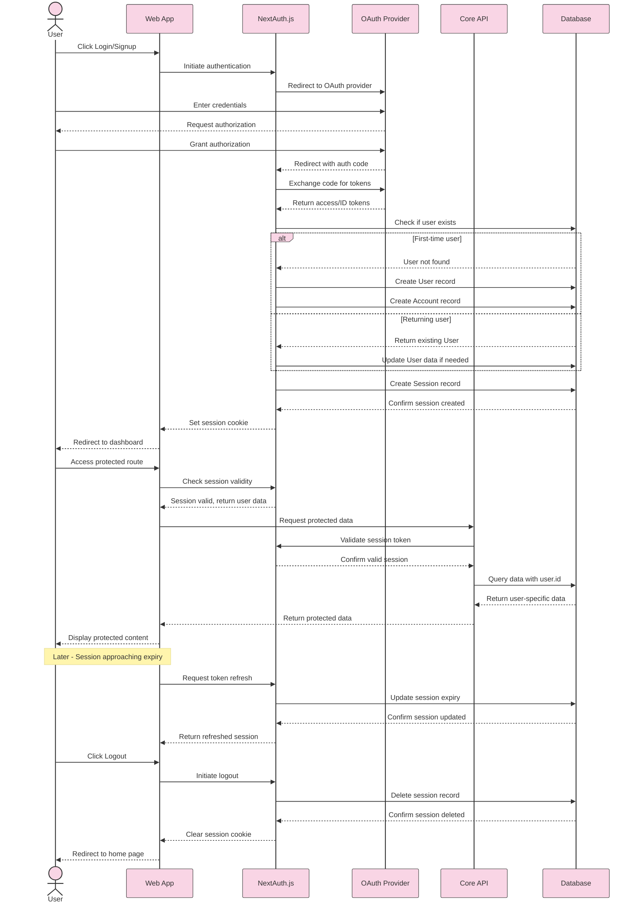

# Authentication Sequence Diagram

_This document visualizes the sequence of interactions between different components during the authentication process in the Meatbag application. The diagram shows the precise order of operations and data flow between the User, Web App, NextAuth.js, OAuth Provider, API, and Database during login, session creation, and protected route access._

## Overview

The Authentication Sequence Diagram illustrates the detailed interactions that occur during user authentication in the Meatbag application. It shows how requests and responses flow between the user interface, authentication services, and database, providing a clear picture of the timing and dependencies of each step in the process.

---

## Component Interactions

- **User → Web App**

  - User initiates authentication by clicking login
  - User interacts with OAuth provider interface
  - User navigates to protected routes after authentication

- **Web App → NextAuth.js**

  - Web app forwards authentication requests to NextAuth.js
  - Web app receives session data from NextAuth.js
  - Web app checks session status for protected routes

- **NextAuth.js → OAuth Provider**

  - NextAuth.js redirects to OAuth provider
  - NextAuth.js receives callback with authentication data
  - NextAuth.js validates tokens with OAuth provider

- **NextAuth.js → Database**

  - NextAuth.js checks for existing user records
  - NextAuth.js creates or updates user records via Prisma Adapter
  - NextAuth.js stores and retrieves session information

- **Web App → API**
  - Web app makes authenticated API requests with session token
  - API validates session token for each request
  - API returns protected data based on user authorization

---

## Authentication Sequence Diagram



---

## Sequence Explanation

### Initial Authentication

1. **User → Web App: Click Login/Signup**

   - User initiates the authentication process by clicking the login button
   - This triggers the authentication flow in the web application

2. **Web App → NextAuth.js: Initiate authentication**

   - The web app calls NextAuth.js's signin function
   - NextAuth.js prepares to authenticate with the specified provider (Google)

3. **NextAuth.js → OAuth Provider: Redirect to OAuth provider**

   - NextAuth.js redirects the browser to the OAuth provider's authentication page
   - The redirect includes application credentials and requested scopes

4. **User → OAuth Provider: Enter credentials**

   - User enters their login credentials on the OAuth provider's page
   - This happens outside of the application's direct control

5. **OAuth Provider → User: Request authorization**

   - OAuth provider asks the user to authorize the application to access their data
   - User is presented with the requested permissions

6. **User → OAuth Provider: Grant authorization**

   - User confirms they want to grant the requested permissions
   - This completes the user's part of the OAuth flow

7. **OAuth Provider → NextAuth.js: Redirect with auth code**

   - OAuth provider redirects back to the application's callback URL
   - The redirect includes an authorization code

8. **NextAuth.js → OAuth Provider: Exchange code for tokens**

   - NextAuth.js exchanges the authorization code for access and ID tokens
   - This happens server-side for security

9. **OAuth Provider → NextAuth.js: Return access/ID tokens**
   - OAuth provider validates the code and returns the requested tokens
   - Tokens contain user information and authentication proof

### Database Integration

10. **NextAuth.js → Database: Check if user exists**

    - NextAuth.js uses the Prisma Adapter to check if the user already exists in the database
    - This query is based on the email address from the OAuth provider

11. **Database → NextAuth.js: User not found (or found)**

    - Database responds with user information or indicates the user doesn't exist
    - This determines the next steps in the flow

12. **For new users:**

    - **NextAuth.js → Database: Create User record**
      - A new user record is created with information from the OAuth provider
      - This includes name, email, and profile image
    - **NextAuth.js → Database: Create Account record**
      - An Account record is created linking the user to their OAuth provider
      - This stores provider-specific information like access tokens

13. **For returning users:**
    - **NextAuth.js → Database: Update User data if needed**
      - User information is updated if it has changed since their last login
      - This keeps profile information in sync with the OAuth provider

### Session Creation

14. **NextAuth.js → Database: Create Session record**

    - NextAuth.js creates a new session record in the database
    - This includes a session token and expiry time

15. **Database → NextAuth.js: Confirm session created**

    - Database confirms the session has been successfully created
    - This allows the authentication process to continue

16. **NextAuth.js → Web App: Set session cookie**

    - NextAuth.js sets a secure HTTP-only cookie with the session token
    - This cookie will be sent with subsequent requests to authenticate the user

17. **Web App → User: Redirect to dashboard**
    - User is redirected to the application dashboard or intended destination
    - The user is now authenticated and can access protected features

### Protected Route Access

18. **User → Web App: Access protected route**

    - User navigates to a route that requires authentication
    - This triggers session validation

19. **Web App → NextAuth.js: Check session validity**

    - The application checks if the user has a valid session
    - This happens through the SessionProvider and useSession hook

20. **NextAuth.js → Web App: Session valid, return user data**

    - If the session is valid, user data is returned to the application
    - This confirms the user is authenticated

21. **Web App → API: Request protected data**

    - The web app makes a request to the API for protected data
    - The session token is included in the request

22. **API → NextAuth.js: Validate session token**

    - The API validates the session token with NextAuth.js
    - This ensures the request is coming from an authenticated user

23. **NextAuth.js → API: Confirm valid session**

    - NextAuth.js confirms the session is valid
    - This allows the API to proceed with the request

24. **API → Database: Query data with user.id**

    - The API queries the database using the user's ID
    - This ensures the user only accesses their own data

25. **Database → API: Return user-specific data**

    - Database returns the requested data for the specific user
    - This maintains data isolation between users

26. **API → Web App: Return protected data**

    - The API returns the protected data to the web app
    - This data is specific to the authenticated user

27. **Web App → User: Display protected content**
    - The web app displays the protected content to the user
    - The user can now interact with their personalized data

### Session Expiry and Refresh

28. **Web App → NextAuth.js: Request token refresh**

    - When a session is approaching expiry, a refresh is requested
    - This happens automatically in the background

29. **NextAuth.js → Database: Update session expiry**

    - NextAuth.js updates the session expiry in the database
    - This extends the user's authenticated session

30. **Database → NextAuth.js: Confirm session updated**

    - Database confirms the session has been updated
    - This allows the user to remain authenticated

31. **NextAuth.js → Web App: Return refreshed session**
    - NextAuth.js returns the refreshed session to the web app
    - The user continues to have access without re-authenticating

### Logout Flow

32. **User → Web App: Click Logout**

    - User initiates the logout process
    - This triggers the session termination flow

33. **Web App → NextAuth.js: Initiate logout**

    - The web app calls NextAuth.js's signout function
    - This begins the process of ending the user's session

34. **NextAuth.js → Database: Delete session record**

    - NextAuth.js removes the session record from the database
    - This invalidates the user's authentication

35. **Database → NextAuth.js: Confirm session deleted**

    - Database confirms the session has been removed
    - This completes the server-side logout process

36. **NextAuth.js → Web App: Clear session cookie**

    - NextAuth.js removes the session cookie from the browser
    - This removes the client-side authentication token

37. **Web App → User: Redirect to home page**
    - User is redirected to the unauthenticated home page
    - The user is now logged out and must re-authenticate to access protected features

---

## Implementation Notes

- The sequence diagram shows the ideal flow; error handling paths are not shown for clarity.
- NextAuth.js handles most of the complexity of OAuth authentication and session management.
- The Prisma Adapter automates the creation and management of user and account records.
- Session tokens should be stored in HTTP-only cookies for security.
- API routes should validate the session token for every request to protected resources.
- Consider implementing CSRF protection for authentication endpoints.
- Session refresh should happen automatically before the session expires.

### Database Schema for Authentication

The authentication sequence relies on these Prisma models:

1. **User Model**

   ```prisma
   model User {
     id                     String    @id @default(uuid())
     name                   String?
     email                  String    @unique
     emailVerified          DateTime?
     image                  String?
     accounts               Account[]
     sessions               Session[]

     // Application-specific fields
     createdAt              DateTime  @default(now()) @map("created_at")
     updatedAt              DateTime  @default(now()) @map("updated_at")
     workoutPrograms        WorkoutProgram[]
     // ... other relations

     @@map("users")
   }
   ```

   This model stores the core user information and is created/updated during steps 12-13 in the sequence diagram.

2. **Account Model**

   ```prisma
   model Account {
     userId            String
     type              String
     provider          String
     providerAccountId String
     refresh_token     String?
     access_token      String?
     expires_at        Int?
     token_type        String?
     scope             String?
     id_token          String?
     session_state     String?

     createdAt DateTime @default(now())
     updatedAt DateTime @updatedAt

     user User @relation(fields: [userId], references: [id], onDelete: Cascade)

     @@id([provider, providerAccountId])
     @@map("accounts")
   }
   ```

   This model links users to their OAuth providers and stores tokens received in step 9. It's created during step 12 for new users.

3. **Session Model**

   ```prisma
   model Session {
     sessionToken String   @unique
     userId       String
     expires      DateTime

     createdAt DateTime @default(now())
     updatedAt DateTime @updatedAt

     user User @relation(fields: [userId], references: [id], onDelete: Cascade)

     @@map("sessions")
   }
   ```

   This model stores active sessions and is created in step 14, updated in step 29, and deleted in step 34.

4. **VerificationToken Model**

   ```prisma
   model VerificationToken {
     identifier String
     token      String
     expires    DateTime

     @@id([identifier, token])
     @@map("verification_tokens")
   }
   ```

   This model supports email verification flows (not shown in the main sequence for simplicity).

The session data accessible in the frontend (as seen in `src/app/page.js`) includes:

- `session.user.name` - User's display name from the OAuth provider
- `session.user.email` - User's email address
- `session.user.image` - User's profile image URL
- `session.userId` - Database ID of the user (from the User model)

---

## Usage Guidance

- Use this diagram to understand the complete authentication flow in the application.
- When implementing new features, ensure they properly check for authentication.
- When debugging authentication issues, trace through this sequence to identify where the problem might be occurring.
- When onboarding new developers, use this diagram to explain how authentication works in the application.

---

## Future Considerations

- **Multi-factor Authentication**: Add additional authentication steps for sensitive operations.
- **Role-based Access Control**: Extend the session with user roles for more granular permissions.
- **Token Revocation**: Implement the ability to revoke sessions remotely for security purposes.
- **Auth Event Logging**: Add detailed logging of authentication events for security auditing.
- **Remember Me Functionality**: Allow users to opt for longer-lived sessions.
- **Cross-device Session Management**: Allow users to view and manage their active sessions.
