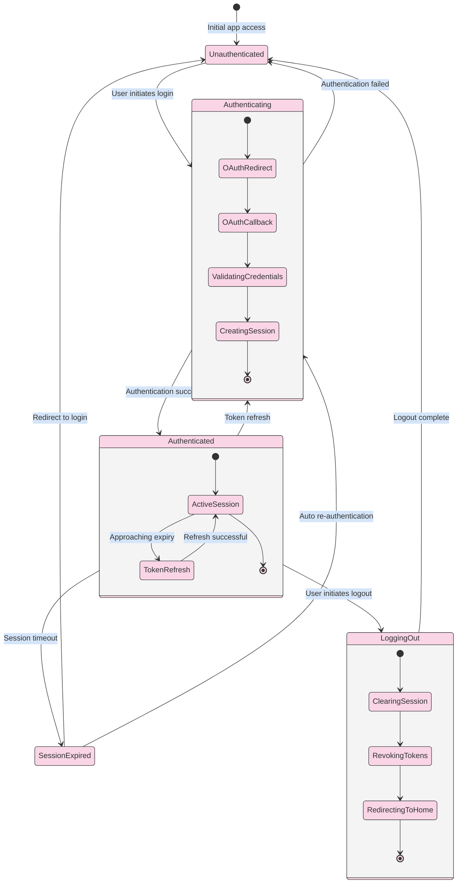

# Authentication State Diagram

_This document visualizes the authentication states in the Meatbag application, detailing the various states a user can be in during the authentication process and the transitions between these states. This state diagram helps clarify the different authentication states, how users move between them, and how the application responds to each state._

## Overview

The Authentication State Diagram represents the possible states a user can be in regarding their authentication status within the Meatbag application. It illustrates how users transition between being unauthenticated, in the process of authenticating, and authenticated, as well as how session management affects these states.

---

## Authentication States

- **Unauthenticated**

  - Initial state for all users
  - No valid session exists
  - Limited access to application features
  - Can only access public routes and authentication pages

- **Authenticating**

  - Transitional state during the authentication process
  - User has initiated authentication but it's not yet complete
  - Includes OAuth redirection and callback processing
  - System is validating credentials or OAuth tokens

- **Authenticated**

  - User has successfully authenticated
  - Valid session exists
  - Full access to authorized application features
  - Session token is present in cookies or storage

- **Session Expired**

  - Previously authenticated user whose session has timed out
  - Session token exists but is no longer valid
  - Requires re-authentication to regain access
  - May retain some user context for smoother re-authentication

- **Logging Out**
  - Transitional state during the logout process
  - Session is being terminated
  - Cleanup operations are being performed
  - User is being redirected to unauthenticated state

---

## Authentication State Diagram



---

## State Transitions Explanation

### From Unauthenticated

1. **Unauthenticated → Authenticating**
   - Triggered when: User clicks login/signup button or attempts to access a protected route
   - Actions: Redirect to authentication provider or display login form
   - System behavior: Initiates the authentication flow with NextAuth.js

### During Authentication

2. **Authenticating (Internal States)**

   - **OAuth Redirect**: User is redirected to Google authentication
   - **OAuth Callback**: Google redirects back with authentication data
   - **Validating Credentials**: System verifies the authentication data
   - **Creating Session**: System establishes a new session for the user

3. **Authenticating → Authenticated**

   - Triggered when: Authentication process completes successfully
   - Actions: Create session, store tokens, redirect to dashboard
   - System behavior: Grants access to protected routes and features

4. **Authenticating → Unauthenticated**
   - Triggered when: Authentication fails (invalid credentials, user cancellation, etc.)
   - Actions: Display error message, return to login page
   - System behavior: Maintains restricted access to protected resources

### From Authenticated

5. **Authenticated (Internal States)**

   - **Active Session**: User has valid authentication tokens
   - **Token Refresh**: System refreshes tokens before they expire

6. **Authenticated → Session Expired**

   - Triggered when: Session timeout occurs without refresh
   - Actions: Detect expired session during route access or API call
   - System behavior: Blocks access to protected resources

7. **Authenticated → Logging Out**

   - Triggered when: User clicks logout button
   - Actions: Begin session termination process
   - System behavior: Initiates cleanup of authentication data

8. **Authenticated → Authenticating (Token Refresh)**
   - Triggered when: Session token is approaching expiration
   - Actions: Silently refresh authentication tokens
   - System behavior: Maintains session continuity without user disruption

### From Session Expired

9. **Session Expired → Authenticating**

   - Triggered when: System attempts automatic re-authentication
   - Actions: Use refresh token to obtain new access token
   - System behavior: Attempts to restore session without user intervention

10. **Session Expired → Unauthenticated**
    - Triggered when: Auto re-authentication fails or isn't possible
    - Actions: Redirect to login page
    - System behavior: Requires explicit user re-authentication

### During Logout

11. **Logging Out (Internal States)**

    - **Clearing Session**: Remove local session data
    - **Revoking Tokens**: Invalidate tokens with authentication provider
    - **Redirecting to Home**: Return user to public application area

12. **Logging Out → Unauthenticated**
    - Triggered when: Logout process completes
    - Actions: Redirect to home or login page
    - System behavior: Restricts access to protected resources

---

## Implementation Notes

- The authentication state is primarily managed by NextAuth.js through its session handling.
- Client-side state is tracked using the `useSession()` hook from NextAuth.js.
- Session expiration is handled through JWT expiration times or database session records.
- Token refresh can be implemented using the NextAuth.js refresh token rotation feature.
- The application should handle edge cases like network disconnection during authentication.

### Database Models Supporting Authentication States

The following Prisma models support the authentication state management:

1. **User Model** - Stores core user information:

   ```prisma
   model User {
     id            String    @id @default(uuid())
     name          String?
     email         String    @unique
     emailVerified DateTime?
     image         String?
     accounts      Account[]
     sessions      Session[]
     // Application-specific fields...
   }
   ```

2. **Account Model** - Links users to OAuth providers (supports the Authenticating state):

   ```prisma
   model Account {
     userId            String
     type              String
     provider          String
     providerAccountId String
     refresh_token     String?  // Enables token refresh transitions
     access_token      String?
     expires_at        Int?     // Determines token expiration
     // Other OAuth fields...

     user User @relation(fields: [userId], references: [id], onDelete: Cascade)

     @@id([provider, providerAccountId])
   }
   ```

3. **Session Model** - Manages active sessions (supports the Authenticated state):

   ```prisma
   model Session {
     sessionToken String   @unique
     userId       String
     expires      DateTime  // Controls Session Expired transitions

     user User @relation(fields: [userId], references: [id], onDelete: Cascade)
   }
   ```

4. **VerificationToken Model** - Handles email verification (part of the Authenticating state):

   ```prisma
   model VerificationToken {
     identifier String
     token      String
     expires    DateTime

     @@id([identifier, token])
   }
   ```

These models directly map to the authentication states in the diagram:

- The existence of a valid Session record corresponds to the Authenticated state
- Expired Session records trigger the Session Expired state
- Account records facilitate OAuth authentication transitions
- VerificationToken records support email verification flows

---

## Usage

- Use this state diagram to understand the possible authentication states in the application.
- Refer to it when implementing authentication-related features or debugging authentication issues.
- Ensure all state transitions are properly handled in the application code.
- Consider implementing appropriate loading states for transitional states like Authenticating and Logging Out.
- For the complete authentication flow, see the [Authentication Flow Diagram](./authentication-flow.md).

---

## Security Considerations

- Implement proper CSRF protection for authentication endpoints.
- Use secure, HTTP-only cookies for storing session tokens.
- Consider implementing rate limiting for authentication attempts.
- Ensure proper validation of all authentication data.
- Handle authentication errors gracefully without revealing sensitive information.
- Implement proper session timeout and idle timeout mechanisms.
- Consider implementing additional security measures like multi-factor authentication for sensitive operations.
