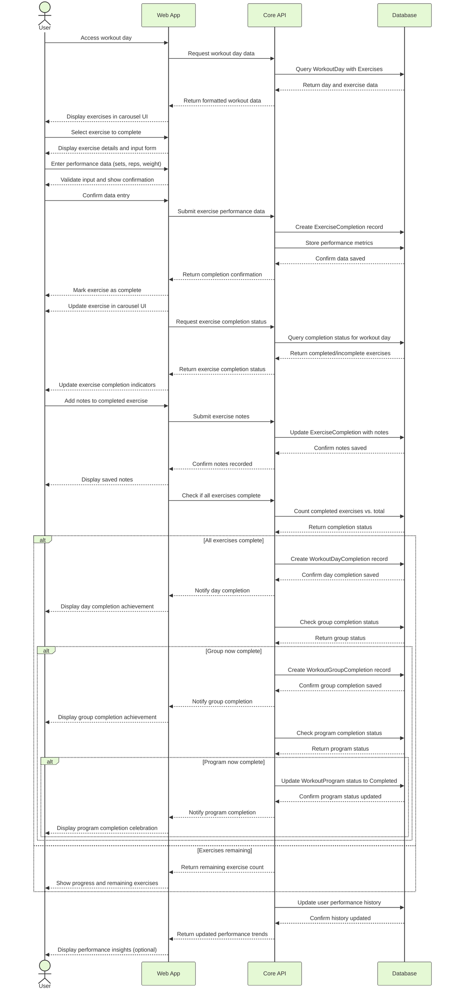

# Exercise Completion Sequence Diagram

_This document visualizes the sequence of interactions between different components during the exercise completion process in the Meatbag application. The diagram shows the precise order of operations and data flow between the User, Web App, Core API, and Database when users record their exercise performance and complete workout activities._

## Overview

The Exercise Completion Sequence Diagram illustrates the detailed interactions that occur when a user completes an exercise in the Meatbag application. It shows how performance data flows from user input through the application layers to storage, and how completion records trigger updates to workout progress tracking.

---

## Component Interactions

- **User → Web App**

  - User inputs exercise performance data (sets, reps, weight)
  - User marks exercises as complete
  - User reviews completion status and progress

- **Web App → Core API**

  - Web app submits exercise performance data
  - Web app requests completion status updates
  - Web app triggers completion record creation

- **Core API → Database**

  - API creates exercise completion records
  - API updates workout day completion status
  - API queries and updates program progress

- **Database → Core API**

  - Database confirms data storage
  - Database returns updated completion status
  - Database provides progress metrics

- **Core API → Web App**
  - API returns confirmation of recorded data
  - API provides updated progress information
  - API delivers achievement notifications

---

## Exercise Completion Sequence Diagram

---

## Sequence Explanation

### Exercise Selection

1. **User → Web App: Access workout day**

   - User navigates to a specific workout day in their program
   - This initiates the exercise completion flow

2. **Web App → Core API: Request workout day data**

   - The web app requests detailed information for the selected workout day
   - This includes all exercises and their current completion status

3. **Core API → Database: Query WorkoutDay with Exercises**

   - The API queries the database for the specific workout day and its exercises
   - This includes any existing completion records

4. **Database → Core API: Return day and exercise data**

   - Database returns comprehensive data for the workout day
   - This includes all exercise details and any previous completion data

5. **Core API → Web App: Return formatted workout data**

   - API processes the database response and formats it for the UI
   - This includes organizing exercises in the correct order

6. **Web App → User: Display exercises in carousel UI**

   - The web app renders the exercises in a swipeable carousel interface
   - This allows users to browse all exercises for the day

7. **User → Web App: Select exercise to complete**

   - User selects a specific exercise they want to perform
   - This can be any exercise in the workout, regardless of order

8. **Web App → User: Display exercise details and input form**
   - The web app shows detailed information about the selected exercise
   - This includes input fields for performance data

### Exercise Performance Data Entry

9. **User → Web App: Enter performance data (sets, reps, weight)**

   - User performs the exercise and enters their performance metrics
   - This typically includes sets completed, reps per set, and weight used

10. **Web App → User: Validate input and show confirmation**

    - The web app validates the entered data for completeness and format
    - This ensures the data meets requirements before submission

11. **User → Web App: Confirm data entry**
    - User confirms that the entered data is correct
    - This triggers the submission process

### Exercise Completion Recording

12. **Web App → Core API: Submit exercise performance data**

    - The web app sends the exercise performance data to the API
    - This includes all metrics entered by the user

13. **Core API → Database: Create ExerciseCompletion record**

    - The API creates a completion record for the exercise
    - This links to the specific exercise, workout day, and user

14. **Core API → Database: Store performance metrics**

    - The API stores the detailed performance metrics
    - This includes sets, reps, weight, and any other tracked metrics

15. **Database → Core API: Confirm data saved**

    - Database confirms the exercise completion and metrics were saved
    - This includes the record IDs for reference

16. **Core API → Web App: Return completion confirmation**

    - API notifies the web app that the exercise was recorded successfully
    - This includes the updated completion status

17. **Web App → User: Mark exercise as complete**

    - The web app visually marks the exercise as complete
    - This provides immediate feedback to the user

18. **Web App → User: Update exercise in carousel UI**
    - The web app updates the exercise's status in the carousel
    - This helps the user track which exercises are complete

### Completion Status Update

19. **Web App → Core API: Request exercise completion status**

    - The web app requests updated completion status information
    - This helps keep exercise status indicators current

20. **Core API → Database: Query completion status for workout day**

    - The API queries the database for the current completion status
    - This retrieves which exercises are complete and which are incomplete

21. **Database → Core API: Return completed/incomplete exercises**

    - Database returns the list of completed and incomplete exercises
    - This provides binary completion status without percentage calculations

22. **Core API → Web App: Return exercise completion status**

    - API returns the simple completion status for each exercise
    - This is a binary complete/incomplete status rather than a percentage

23. **Web App → User: Update exercise completion indicators**
    - The web app updates visual indicators showing which exercises are complete
    - This gives the user clear feedback on what's done and what remains

### Optional Notes Addition

24. **User → Web App: Add notes to completed exercise**

    - User optionally adds notes about their exercise performance
    - This might include subjective feedback or observations

25. **Web App → Core API: Submit exercise notes**

    - The web app sends the notes to the API
    - This is associated with the specific exercise completion

26. **Core API → Database: Update ExerciseCompletion with notes**

    - The API updates the exercise completion record with the notes
    - This preserves the user's observations for future reference

27. **Database → Core API: Confirm notes saved**

    - Database confirms the notes were saved successfully
    - This completes the notes addition process

28. **Core API → Web App: Confirm notes recorded**

    - API notifies the web app that the notes were recorded
    - This allows the UI to update accordingly

29. **Web App → User: Display saved notes**
    - The web app shows the saved notes to the user
    - This confirms their input was preserved

### Day Completion Check

30. **Web App → Core API: Check if all exercises complete**

    - After each exercise completion, the web app checks if all exercises are now complete
    - This determines if the day itself can be marked complete

31. **Core API → Database: Count completed exercises vs. total**

    - The API queries the database to count completed exercises
    - This is compared against the total number of exercises for the day

32. **Database → Core API: Return completion status**

    - Database returns the counts and completion status
    - This determines the next steps in the flow

33. **For completed days:**

    - **Core API → Database: Create WorkoutDayCompletion record**
      - The API creates a completion record for the entire workout day
      - This links to the specific workout day and user
    - **Database → Core API: Confirm day completion saved**
      - Database confirms the day completion record was saved
      - This includes the record ID for reference
    - **Core API → Web App: Notify day completion**
      - API notifies the web app that the day was marked complete
      - This triggers UI updates and potentially notifications
    - **Web App → User: Display day completion achievement**
      - The web app shows a celebration or achievement for completing the day
      - This provides positive reinforcement to the user

34. **For incomplete days:**
    - **Core API → Web App: Return remaining exercise count**
      - API calculates and returns how many exercises remain
      - This helps the user understand what's left to do
    - **Web App → User: Show progress and remaining exercises**
      - The web app shows the current progress and highlights remaining exercises
      - This guides the user to complete the remaining work

### Group/Program Completion Check

35. **When a day is completed, check group completion:**

    - **Core API → Database: Check group completion status**
      - The API queries if all days in the group are now complete
      - This determines if the group can be marked complete
    - **Database → Core API: Return group status**
      - Database returns whether the group is now complete
      - This determines the next steps

36. **For completed groups:**

    - **Core API → Database: Create WorkoutGroupCompletion record**
      - The API creates a completion record for the entire workout group
      - This links to the specific workout group and user
    - **Database → Core API: Confirm group completion saved**
      - Database confirms the group completion record was saved
      - This includes the record ID for reference
    - **Core API → Web App: Notify group completion**
      - API notifies the web app that the group was marked complete
      - This triggers UI updates and potentially notifications
    - **Web App → User: Display group completion achievement**
      - The web app shows a celebration or achievement for completing the group
      - This provides positive reinforcement to the user

37. **When a group is completed, check program completion:**

    - **Core API → Database: Check program completion status**
      - The API queries if all groups in the program are now complete
      - This determines if the program can be marked complete
    - **Database → Core API: Return program status**
      - Database returns whether the program is now complete
      - This determines the next steps

38. **For completed programs:**
    - **Core API → Database: Update WorkoutProgram status to Completed**
      - The API updates the workout program's status to Completed
      - This changes the program state from Active to Completed
    - **Database → Core API: Confirm program status updated**
      - Database confirms the program status was updated
      - This includes the updated program record
    - **Core API → Web App: Notify program completion**
      - API notifies the web app that the program was marked complete
      - This triggers UI updates and potentially notifications
    - **Web App → User: Display program completion celebration**
      - The web app shows a celebration for completing the entire program
      - This provides significant positive reinforcement to the user

### Performance History Update

39. **Core API → Database: Update user performance history**

    - The API updates the user's performance history with the new data
    - This allows for tracking progress over time

40. **Database → Core API: Confirm history updated**

    - Database confirms the history was updated successfully
    - This completes the data recording process

41. **Core API → Web App: Return updated performance trends**

    - API calculates and returns updated performance trends
    - This might include improvements in weight, reps, or other metrics

42. **Web App → User: Display performance insights (optional)**
    - The web app may show performance insights to the user
    - This could include progress graphs or achievement notifications

---

## Implementation Notes

- The sequence diagram shows the ideal flow; error handling paths are not shown for clarity.
- Exercise completion should validate user input to ensure data quality.
- The system should support partial completion of exercises (e.g., completing fewer sets than planned).
- Consider implementing optimistic UI updates to provide immediate feedback before server confirmation.
- The API should batch multiple completion records when possible to reduce network requests.
- Database operations should use transactions where appropriate to ensure data consistency.
- Performance history should be efficiently stored to support future analysis and visualization.

---

## Usage Guidance

- Use this diagram to understand the detailed flow of exercise completion in the application.
- When implementing exercise tracking features, ensure they follow this sequence of operations.
- When debugging completion issues, trace through this sequence to identify where the problem might be occurring.
- When onboarding new developers, use this diagram to explain how exercise completion works.

---

## Documentation Considerations

While sequence diagrams like this are valuable for:

- Clarifying thoughts and communication during development
- Visualizing complex interactions between system components
- Onboarding new team members to understand system flows
- Identifying potential bottlenecks or optimization opportunities

They also have important limitations:

- **Quick Obsolescence**: These diagrams become outdated quickly as code evolves
- **Maintenance Burden**: Keeping sequence diagrams in sync with implementation is challenging
- **Implementation Details**: They may contain too many implementation details that change frequently
- **Limited Scope**: They typically show "happy path" flows and omit error handling

For long-term documentation, consider complementing sequence diagrams with:

- Higher-level architecture diagrams that change less frequently
- Written documentation focused on concepts rather than specific interactions
- Code comments that evolve alongside the implementation
- Automated tests that verify the actual behavior

The most valuable use of sequence diagrams is during initial development and major refactoring efforts, where they help align understanding across the team. After implementation, their value as documentation diminishes unless actively maintained.

---

## Future Considerations

- **Offline Support**: Add handling for exercises completed while offline.
- **Bulk Completion**: Allow users to mark multiple exercises complete at once.
- **Performance Comparisons**: Show comparisons to previous performance during completion.
- **Form Tracking**: Add support for tracking exercise form quality.
- **Voice Input**: Consider voice commands for hands-free exercise logging.
- **Smart Suggestions**: Implement AI-based suggestions for next weight/reps based on previous performance.
- **Social Sharing**: Allow users to share completed exercises with friends or coaches.
