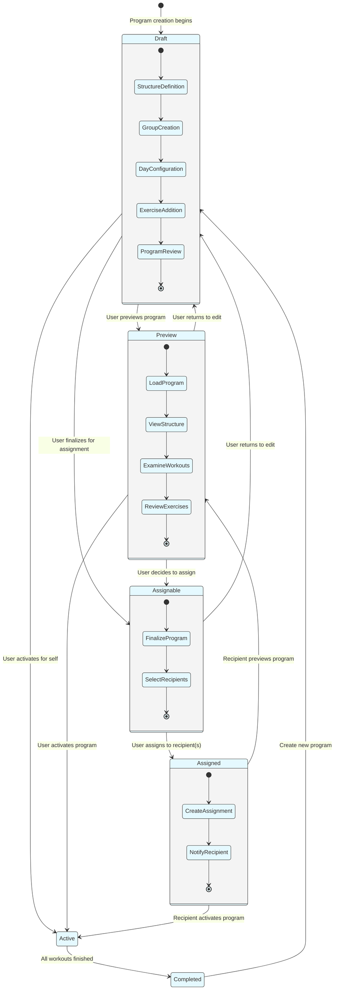

# Program Sharing State Diagram

_This document visualizes the states and transitions involved in creating, previewing, and sharing workout programs in the Meatbag application. It details how programs move through different states from creation to being assigned to other users._

## Overview

The Program Sharing State Diagram represents the possible states a workout program can be in throughout the sharing lifecycle. It illustrates how programs can be created, previewed before activation or assignment, and directly assigned to other users. This functionality allows users to create workout plans for others and preview programs before committing to them.

---

## Program Sharing States

- **Draft**

  - Initial state for all newly created programs
  - Program structure is being defined
  - User is adding workout groups, days, and exercises
  - Program is not yet ready for preview, activation, or sharing

- **Preview**

  - Program is being viewed in a read-only mode
  - User can see how the program will appear when active
  - No actual workout tracking occurs in this state
  - User can return to Draft for modifications or proceed to Active/Shareable

- **Assignable**

  - Program has been finalized and is ready to be assigned
  - Program structure is locked for assignment purposes
  - User can select recipients from available users

- **Assigned**

  - Program has been successfully assigned to one or more recipients
  - Original creator maintains ownership of the program
  - Program is available to recipients for preview or activation

- **Active**

  - Program is currently in use by the creator or a recipient
  - User is actively progressing through workout days
  - System is tracking completion of exercises and days
  - Progress metrics are being recorded

- **Completed**
  - All workout days in the program have been finished
  - User has successfully progressed through the entire program
  - Final metrics and achievements are calculated
  - Program completion is tracked in user history

---

## Program Sharing State Diagram

---

## State Transitions Explanation

### From Draft State

1. **Draft → Preview**

   - Triggered when: User wants to see how the program will appear when active
   - Actions: System renders program in read-only view mode
   - System behavior: Provides a non-interactive view of the complete program

2. **Draft → Assignable**

   - Triggered when: User finalizes program for assignment purposes
   - Actions: System prepares program for assignment to other users
   - System behavior: Locks program structure and prepares assignment mechanisms

3. **Draft → Active**
   - Triggered when: User completes program setup and activates it for themselves
   - Actions: System prepares first workout day, initializes progress tracking
   - System behavior: Transitions program to active execution mode

### From Preview State

4. **Preview → Draft**

   - Triggered when: User decides to make changes after preview
   - Actions: System returns to editable mode
   - System behavior: Allows modifications to program structure

5. **Preview → Active**

   - Triggered when: User or recipient decides to use the program after preview
   - Actions: System activates program for the user
   - System behavior: Begins tracking progress through the program

6. **Preview → Assignable**
   - Triggered when: User decides to assign program after previewing
   - Actions: System prepares assignment mechanisms
   - System behavior: Transitions to assignable state with recipient selection

### From Assignable State

7. **Assignable → Assigned**

   - Triggered when: User assigns the program to one or more recipients
   - Actions: System creates WorkoutAssignment records for selected recipients
   - System behavior: Tracks assignment status and recipient access

8. **Assignable → Draft**
   - Triggered when: User decides to make changes before assigning
   - Actions: System returns to editable mode
   - System behavior: Allows modifications to program structure

### From Assigned State

9. **Assigned → Preview**

   - Triggered when: Recipient views the assigned program
   - Actions: System renders program in read-only view mode for recipient
   - System behavior: Provides recipient with non-interactive preview

10. **Assigned → Active**
    - Triggered when: Recipient adopts the assigned program
    - Actions: System creates a copy of the program for recipient's use
    - System behavior: Begins tracking recipient's progress through the program

### From Active State

11. **Active → Completed**
    - Triggered when: User finishes all workout days in the program
    - Actions: Final metrics are calculated, achievements are awarded
    - System behavior: Marks program as successfully completed

### From Completed State

12. **Completed → Draft**
    - Triggered when: User creates a new program after completing one
    - Actions: System creates a new draft program, potentially using the completed one as reference
    - System behavior: Allows creation of a new program structure

---

## Internal State Processes

### Draft Process

- **Structure Definition**: Basic program parameters are set
- **Group Creation**: Workout groups are added to the program
- **Day Configuration**: Workout days are configured within groups
- **Exercise Addition**: Exercises are added to workout days
- **Program Review**: Complete program structure is reviewed

### Preview Process

- **Load Program**: Program structure is loaded in view-only mode
- **View Structure**: Overall program structure is displayed
- **Examine Workouts**: Individual workout days can be examined
- **Review Exercises**: Exercise details can be viewed

### Assignable Process

- **Finalize Program**: Program structure is locked for assignment
- **Select Recipients**: Creator selects users to assign the program to

### Assigned Process

- **Create Assignment**: System creates WorkoutAssignment records
- **Notify Recipient**: System notifies recipients of assigned program

---

## Implementation Notes

- The program assignment state should be explicitly stored in the database using the WorkoutAssignment entity.
- Assigned programs should maintain a reference to the original creator through the senderId field.
- When a recipient activates an assigned program, a new instance should be created in their account with all workout groups, days, and exercises.
- Preview mode should be read-only but provide complete visibility of the program structure.
- The WorkoutAssignment entity should track when the assignment occurred and whether it's currently active.

---

## Usage

- Use this state diagram to understand the possible states of assigned workout programs.
- Refer to it when implementing program assignment features.
- Ensure all state transitions are properly handled in the application code.
- Consider the user experience implications of each state transition.
- For the complete workout creation process, see the [Workout Creation Flow Diagram](./workout-creation-flow.md).

---

## Future Considerations

- **Collaborative Editing**: Allow multiple users to edit a program simultaneously.
- **Template Library**: Create a public repository of assignable program templates.
- **Feedback System**: Allow recipients to provide feedback on assigned programs.
- **Version Control**: Track changes to programs across assignment events.
- **Access Levels**: Implement different levels of access for assigned programs (view, use, edit).
- **Analytics Dashboard**: In future versions, allow creators to see how their assigned programs are being used.
- **Sharing Links**: In future versions, implement shareable links for public distribution of programs.
