# Stats Dashboard State Diagram

_This document visualizes the states and transitions involved in the Stats Dashboard functionality of the Meatbag application. It details how workout metrics are collected, processed, and displayed to provide users with insights into their fitness progress._

## Overview

The Stats Dashboard State Diagram represents the possible states of the workout statistics tracking system. It illustrates how workout data flows from completion to analysis, how metrics are calculated and displayed, and how users can interact with their historical workout data to gain insights into their progress over time.

---

## Stats Dashboard States

- **Data Collection**

  - System is gathering raw workout data
  - Exercise completions are being recorded
  - Set/rep counts and weights are being stored
  - Timestamps are being associated with activities

- **Data Storage**

  - Raw workout data is being saved to the database
  - `ExerciseCompletion`, `WorkoutDayCompletion`, and `WorkoutGroupCompletion` records are created
  - User-submitted values (weights, reps, notes) are preserved in `ExerciseCompletion`
  - Historical records are maintained for future reference

- **Dashboard View**

  - Completed `WorkoutProgram`s are listed
  - Completed `WorkoutGroup`s (weeks) and `WorkoutDay`s are displayed
  - Completed `Exercise`s with submitted data are shown
  - Basic chronological history of workouts is presented

- **Exercise History View**
  - User is viewing history of a specific `Exercise`
  - Previous weights, reps, and sets from `ExerciseCompletion` records are displayed
  - `userNotes` from past completions are accessible
  - Simple chronological progression is shown

---

## Stats Dashboard State Diagram

```mermaid
%%{
  init: {
    'theme': 'base',
    'themeVariables': {
      'primaryColor': '#f9e5ff',
      'primaryTextColor': '#333',
      'primaryBorderColor': '#333',
      'lineColor': '#333',
      'fontSize': '16px'
    }
  }
}%%

stateDiagram-v2
    [*] --> DataCollection: Workout completed

    DataCollection --> DataStorage: Raw data collected

    DataStorage --> DashboardView: Data retrieved

    DashboardView --> ExerciseHistoryView: User selects specific exercise

    ExerciseHistoryView --> DashboardView: User returns to dashboard

    state DataCollection {
        [*] --> ExerciseLogging
        ExerciseLogging --> SetRepRecording
        SetRepRecording --> WorkoutCompletion
        WorkoutCompletion --> TimestampAttachment
        TimestampAttachment --> [*]
    }

    state DataStorage {
        [*] --> CreateExerciseCompletions
        CreateExerciseCompletions --> CreateDayCompletions
        CreateDayCompletions --> CreateGroupCompletions
        CreateGroupCompletions --> StoreUserValues
        StoreUserValues --> [*]
    }

    state DashboardView {
        [*] --> CompletedProgramsList
        CompletedProgramsList --> WorkoutGroupsList
        WorkoutGroupsList --> WorkoutDaysList
        WorkoutDaysList --> ExercisesList
        ExercisesList --> [*]
    }

    state ExerciseHistoryView {
        [*] --> LoadExerciseHistory
        LoadExerciseHistory --> DisplayPreviousValues
        DisplayPreviousValues --> ShowChronologicalOrder
        ShowChronologicalOrder --> [*]
    }
```

---

## State Transitions Explanation

### Initial Data Flow

1. **[Start] → Data Collection**

   - Triggered when: User completes a workout or exercise
   - Actions: System begins recording workout data
   - System behavior: Captures raw exercise, set, rep data, and weights

2. **Data Collection → Data Storage**

   - Triggered when: All raw workout data has been collected
   - Actions: System saves the completion data to the database
   - System behavior: Creates completion records with user-submitted values

3. **Data Storage → Dashboard View**
   - Triggered when: User navigates to the stats dashboard
   - Actions: System retrieves completed workout records
   - System behavior: Displays list of completed programs, days, and exercises

### From Dashboard View

4. **Dashboard View → Exercise History View**
   - Triggered when: User selects a specific exercise to view history
   - Actions: System loads historical data for the selected exercise
   - System behavior: Presents chronological list of previous completions with weights, reps, and notes

### From Exercise History View

5. **Exercise History View → Dashboard View**
   - Triggered when: User returns to the main dashboard
   - Actions: System reloads the dashboard view
   - System behavior: Displays list of completed programs, days, and exercises

---

## Internal State Processes

### Data Collection Process

- **Exercise Logging**: Individual exercises are recorded as completed
- **Set/Rep Recording**: Number of sets, reps, and weights are captured
- **Workout Completion**: Overall workout session is marked as finished
- **Timestamp Attachment**: Date and time of completion are recorded

### Data Storage Process

- **Create Exercise Completions**: `ExerciseCompletion` records are created with exercise data
- **Create Day Completions**: `WorkoutDayCompletion` records are created when all exercises are complete
- **Create Group Completions**: `WorkoutGroupCompletion` records are created when all days are complete
- **Store User Values**: User-submitted weights, reps, and notes are preserved in `ExerciseCompletion`

### Dashboard View Process

- **Completed Programs List**: `WorkoutProgram`s with completions are shown
- **Workout Groups List**: Completed `WorkoutGroup`s (weeks) are displayed
- **Workout Days List**: Completed `WorkoutDay`s are displayed
- **Exercises List**: Completed `Exercise`s with their data are presented

### Exercise History View Process

- **Load Exercise History**: `ExerciseCompletion` records for specific exercise are retrieved
- **Display Previous Values**: Past weights, reps, and sets from completions are shown
- **Show Chronological Order**: History is presented in `completedAt` date order

---

## Implementation Notes

- The stats dashboard should display the most recent workout data when loaded.
- Focus on simple, readable lists of completed items rather than complex visualizations for MVP.
- Ensure proper database queries to efficiently retrieve `ExerciseCompletion`, `WorkoutDayCompletion`, and `WorkoutGroupCompletion` records.
- Store all user-submitted values (weights, reps, notes) in the `ExerciseCompletion` entity.
- Organize exercise history in chronological order by `completedAt` to easily see progression.
- Leverage the relationships between completion entities and their parent entities as defined in the domain model.
- Support sorting and filtering of completion data by `WorkoutGroup` (week) for better organization.

---

## Usage

- Use this state diagram to understand the data flow in the stats tracking system.
- Refer to it when implementing dashboard features and metric calculations.
- Ensure all state transitions are properly handled in the application code.
- Consider the user experience implications of each state transition.
- For the workout completion process that generates the initial data, see the [Workout Creation Flow Diagram](../workout/workout-creation-flow.md).

---

## Future Considerations

- **Data Visualization**: Add charts and graphs to visualize progress over time.
- **Goal Tracking**: Implement functionality to set and track fitness goals.
- **Advanced Analytics**: Calculate trends, patterns, and performance insights.
- **Report Generation**: Allow users to export or share their stats.
- **Social Comparison**: Add functionality to anonymously compare stats with other users.
- **Nutrition Integration**: Combine workout data with nutrition tracking for comprehensive health insights.
- **Wearable Device Integration**: Import additional metrics from fitness trackers and wearables.
