# Workout Creation Flow Diagram

_This document visualizes the workout creation flow in the Meatbag application, detailing the process from initial program setup through workout group creation, day configuration, exercise addition, and program execution. This flowchart helps clarify how users create and structure their workout programs, how exercises are added to workout days, and how users progress through their workout plans._

## Overview

The Workout Creation Flow diagram below represents the complete journey of a user through the process of creating a workout program in the Meatbag application. It illustrates how users build their workout structure from scratch, configure workout days, add exercises, and begin executing their workout plan.

---

## Workout Creation Process Phases

- **Program Initialization Phase**

  - User logs into the application
  - User navigates to "Create New Program" section
  - User enters basic program details (name, description)
  - System creates empty program structure in database

- **Workout Group Creation Phase**

  - User adds workout groups to the program
  - System creates default 7-day structure for each group
  - All days default to rest days initially
  - System saves group structure to the program

- **Workout Day Configuration Phase**

  - User selects which days will be exercise days (vs. rest days)
  - For exercise days, user provides basic day information
  - User can reorder workout days using drag and drop
  - System updates the workout day sequence in the database

- **Exercise Addition Phase**

  - For each exercise day, user accesses exercise builder interface
  - User creates exercises with name, notes, target sets, and reps
  - User can add any number of exercises to a workout day
  - System saves each exercise to the associated workout day

- **Program Refinement Phase**

  - User can create additional workout groups if needed
  - User can modify existing workout days and exercises
  - User can reorder exercises within a workout day
  - System updates all changes in real-time

- **Program Execution Phase**
  - Once structure is complete, user views their workout plan
  - System identifies the first incomplete workout day
  - User begins the workout by accessing that day
  - User marks exercises as complete during the workout
  - When all exercises are complete, system advances to next workout day

---

## Workout Creation Flow Diagram

```mermaid
%%{
  init: {
    'flowchart': {
      'nodeSpacing': 50,
      'rankSpacing': 50,
      'curve': 'basis',
      'htmlLabels': true
    },
    'theme': 'base',
    'themeVariables': {
      'primaryColor': '#d5e5f9',
      'primaryTextColor': '#333',
      'primaryBorderColor': '#333',
      'lineColor': '#333',
      'fontSize': '16px'
    }
  }
}%%

flowchart TD
    %% Program Initialization Phase
    A["User logs in"] --> B["User navigates to<br>Create New Program"]
    B --> C["User enters program<br>name & description"]
    C --> D["System creates<br>program structure"]
    D --> E["Program builder<br>interface displayed"]

    %% Workout Group Creation Phase
    E --> F["User adds<br>workout group"]
    F --> G["System creates default<br>7-day structure"]
    G --> H["All days default<br>to rest days"]
    H --> I["Group structure<br>saved to database"]

    %% Workout Day Configuration Phase
    I --> J["User selects days to<br>be exercise days"]
    J --> K["User provides<br>day information"]
    K --> L["User can reorder<br>workout days"]
    L --> M["Day sequence<br>updated in database"]

    %% Exercise Addition Phase
    M --> N["User accesses exercise<br>builder for a day"]
    N --> O["User creates exercise<br>with details"]
    O --> P["User adds target sets,<br>reps & notes"]
    P --> Q["Exercise saved to<br>workout day"]
    Q --> R{"Add another<br>exercise?"}
    R -->|Yes| N
    R -->|No| S["All exercises<br>saved for day"]

    %% Program Refinement Phase
    S --> T{"Modify program<br>further?"}
    T -->|"Add more groups"| F
    T -->|"Edit days/exercises"| U["User modifies<br>existing content"]
    U --> V["System updates<br>changes in real-time"]
    V --> T
    T -->|"Complete"| W["Program structure<br>finalized"]

    %% Program Execution Phase
    W --> X["User views<br>workout plan"]
    X --> Y["System identifies first<br>incomplete workout day"]
    Y --> Z["User begins<br>workout"]
    Z --> AA["User marks exercises<br>as complete"]
    AA --> AB{"All exercises<br>complete?"}
    AB -->|No| Z
    AB -->|Yes| AC["System advances to<br>next workout day"]
    AC --> AD["User continues<br>program progression"]

    %% Styling
    classDef initPhase fill:#d5e5f9,stroke:#333,stroke-width:1px
    classDef groupPhase fill:#f9e5d5,stroke:#333,stroke-width:1px
    classDef dayPhase fill:#e5f9d5,stroke:#333,stroke-width:1px
    classDef exercisePhase fill:#f9d5e5,stroke:#333,stroke-width:1px
    classDef refinePhase fill:#e5d5f9,stroke:#333,stroke-width:1px
    classDef execPhase fill:#f9f9d5,stroke:#333,stroke-width:1px

    class A,B,C,D,E initPhase
    class F,G,H,I groupPhase
    class J,K,L,M dayPhase
    class N,O,P,Q,R,S exercisePhase
    class T,U,V,W refinePhase
    class X,Y,Z,AA,AB,AC,AD execPhase
```

---

## Flow Explanation

### Program Initialization Phase

1. **User Access**: User logs into the application and navigates to the "Create New Program" section.
2. **Program Details**: User enters basic information for the new program, including name and description.
3. **Structure Creation**: The system creates an empty program structure in the database.
4. **Builder Interface**: User is presented with the program builder interface to begin creating workout content.

### Workout Group Creation Phase

5. **Group Addition**: User adds a workout group to the program.
6. **Default Structure**: The system automatically creates a default 7-day structure for the group.
7. **Default Configuration**: All days are initially set as rest days by default.
8. **Data Persistence**: The group structure is saved to the database.

### Workout Day Configuration Phase

9. **Day Selection**: User selects which days will be exercise days (as opposed to rest days).
10. **Day Information**: For exercise days, user provides basic information about the workout.
11. **Day Ordering**: User can reorder workout days using drag and drop functionality.
12. **Sequence Update**: The system updates the workout day sequence in the database.

### Exercise Addition Phase

13. **Exercise Builder**: For each exercise day, user accesses the exercise builder interface.
14. **Exercise Creation**: User creates exercises with specific details:
    - Name and notes
    - Target warmup sets
    - Target working sets
    - Target reps
15. **Multiple Exercises**: User can add any number of exercises to a single workout day.
16. **Exercise Storage**: Each exercise is saved to its associated workout day in the database.

### Program Refinement Phase

17. **Additional Groups**: User can create additional workout groups if needed.
18. **Content Modification**: User can modify existing workout days and exercises.
19. **Exercise Reordering**: User can reorder exercises within a workout day.
20. **Real-time Updates**: The system updates all changes in real-time.

### Program Execution Phase

21. **Plan Overview**: Once the structure is complete, user views their workout plan.
22. **Progress Tracking**: The system identifies the first incomplete workout day.
23. **Workout Initiation**: User begins the workout by accessing that day.
24. **Exercise Completion**: User marks exercises as complete during the workout.
25. **Progression**: When all exercises are complete, the system advances to the next workout day.

---

## Implementation Notes

- The workout creation flow relies on a flexible database structure that allows for variable numbers of workout groups, days, and exercises.
- The system must maintain the relationship between programs, groups, days, and exercises while allowing for easy modification.
- Drag and drop functionality for reordering workout days and exercises requires client-side state management and server synchronization.
- The progression logic must track completed workouts and identify the next workout day in sequence.

---

## Usage

- Use this flowchart as a reference for understanding the workout creation process.
- Refer to it when implementing or debugging workout creation features.
- Update the diagram as the workout creation flow evolves.
- For more detail on database models, see the [ERD Diagram](../../system-architecture/erd-diagram.md).

---

## Future Flowchart Ideas

Here are several other flowchart ideas that could be developed in the future:

1. **Exercise Completion Flow** - Detailing how users progress through exercises within a workout day, including tracking sets, reps, weights, and marking exercises as complete.

2. **Workout Progression Flow** - Visualizing how users advance through their workout program, including rest days, exercise days, and completion tracking.

3. **Program Assignment Flow** - Showing how pre-made workout programs can be assigned to users, including any customization options.

4. **User Statistics Flow** - Illustrating how workout data is collected, processed, and presented as user statistics and progress charts.

5. **Social Sharing Flow** - Mapping the process of sharing workout programs with other users, including permissions and visibility settings.

6. **Exercise Library Management Flow** - Detailing how the exercise library is maintained, including adding new exercises, categorization, and search functionality.

7. **Workout History & Analytics Flow** - Showing how historical workout data is stored, analyzed, and presented to users for performance tracking.
