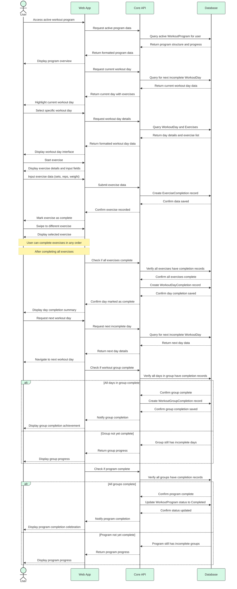

# Workout Day Navigation Sequence Diagram

_This document visualizes the sequence of interactions between different components during workout day navigation in the Meatbag application. The diagram shows the precise order of operations and data flow between the User, Web App, Core API, and Database when users navigate through their workout program, access workout days, complete exercises, and progress to the next workout day._

## Overview

The Workout Day Navigation Sequence Diagram illustrates the detailed interactions that occur when a user navigates through their workout program in the Meatbag application. It shows how requests and responses flow between the user interface, API services, and database, providing a clear picture of the timing and dependencies of each step in the process.

---

## Component Interactions

- **User → Web App**

  - User accesses their active workout program
  - User selects and navigates to specific workout days
  - User completes exercises and marks workout days as complete

- **Web App → Core API**

  - Web app requests current workout day information
  - Web app submits exercise completion data
  - Web app requests next workout day after completion

- **Core API → Database**

  - API queries for active program and current workout day
  - API records exercise and workout day completion
  - API updates program progress and determines next workout day

- **Database → Core API**

  - Database returns program structure and current workout day
  - Database confirms completion records are saved
  - Database provides updated program state and next workout day

- **Core API → Web App**
  - API returns formatted workout day data for display
  - API confirms exercise and day completion status
  - API provides navigation information for next workout day

---

## Workout Day Navigation Sequence Diagram

---

## Sequence Explanation

### Initial Program Access

1. **User → Web App: Access active workout program**

   - User navigates to their active workout program in the application
   - This initiates the workout day navigation flow

2. **Web App → Core API: Request active program data**

   - The web app requests data for the user's active workout program
   - This includes program structure and current progress

3. **Core API → Database: Query active WorkoutProgram for user**

   - The API queries the database for the user's active workout program
   - This includes all related workout groups, days, and exercises

4. **Database → Core API: Return program structure and progress**

   - Database returns the complete program structure
   - This includes completion status for all components

5. **Core API → Web App: Return formatted program data**

   - API processes the database response and formats it for the UI
   - This includes organizing days by groups and calculating progress

6. **Web App → User: Display program overview**
   - The web app renders the program overview interface
   - This shows all workout groups and days with their completion status

### Current Day Identification

7. **Web App → Core API: Request current workout day**

   - The web app requests information about the current workout day
   - This is typically the next incomplete day in the program

8. **Core API → Database: Query for next incomplete WorkoutDay**

   - The API queries the database for the next workout day without a completion record
   - This follows the program's defined sequence

9. **Database → Core API: Return current workout day data**

   - Database returns details for the identified current workout day
   - This includes all associated exercises

10. **Core API → Web App: Return current day with exercises**

    - API formats the current day data for display
    - This includes exercise details and any previous attempt data

11. **Web App → User: Highlight current workout day**
    - The web app visually highlights the current workout day
    - This helps the user identify where they should continue

### Workout Day Selection

12. **User → Web App: Select specific workout day**

    - User clicks on a specific workout day to view or perform
    - This may be the current day or another day they wish to view

13. **Web App → Core API: Request workout day details**

    - The web app requests detailed information for the selected day
    - This includes all exercises and their completion status

14. **Core API → Database: Query WorkoutDay and Exercises**

    - The API queries the database for the specific workout day and its exercises
    - This includes any completion records for the exercises

15. **Database → Core API: Return day details and exercise list**

    - Database returns comprehensive data for the workout day
    - This includes all exercise details and completion status

16. **Core API → Web App: Return formatted workout day data**

    - API processes the database response and formats it for the UI
    - This includes organizing exercises in the correct order

17. **Web App → User: Display workout day interface**
    - The web app renders the workout day interface
    - This shows all exercises for the day and their status

### Exercise Execution

18. **User → Web App: Start exercise**

    - User begins a specific exercise in the workout day
    - This initiates the exercise execution flow

19. **Web App → User: Display exercise details and input fields**

    - The web app shows detailed information about the exercise
    - This includes input fields for sets, reps, and weight

20. **User → Web App: Input exercise data (sets, reps, weight)**

    - User performs the exercise and enters their performance data
    - This includes completed sets, reps, and weight used

21. **Web App → Core API: Submit exercise data**

    - The web app sends the exercise completion data to the API
    - This includes all user-entered metrics

22. **Core API → Database: Create ExerciseCompletion record**

    - The API creates a completion record for the exercise
    - This links to the specific exercise, workout day, and user

23. **Database → Core API: Confirm data saved**

    - Database confirms the exercise completion record was saved
    - This includes the record ID for reference

24. **Core API → Web App: Confirm exercise recorded**

    - API notifies the web app that the exercise was recorded successfully
    - This includes the updated completion status

25. **Web App → User: Mark exercise as complete**
    - The web app visually marks the exercise as complete
    - This provides immediate feedback to the user

### Exercise Navigation (Carousel/Swipe UI)

26. **User → Web App: Swipe to different exercise**

    - User swipes or navigates to any exercise of their choice
    - This allows flexibility based on equipment availability or preference
    - For example, if bench press equipment is occupied, user can do triceps first

27. **Web App → User: Display selected exercise**

    - The web app immediately shows the selected exercise
    - All exercises are already loaded in the client, enabling quick navigation
    - This provides a smooth carousel/swipe experience, especially on mobile

28. **Note: User can complete exercises in any order**
    - The system does not enforce a specific exercise sequence
    - All exercises for the workout day are fetched at once
    - Users see one exercise at a time on mobile (carousel/swipe UI)
    - Users can freely navigate between exercises based on preference or gym conditions

### Day Completion

32. **Web App → Core API: Check if all exercises complete**

    - After a user completes an exercise, the web app checks if all exercises for the day are complete
    - This determines if the day itself can be marked complete

33. **Core API → Database: Verify all exercises have completion records**

    - The API queries the database to check if all exercises have completion records
    - This ensures the day is truly complete

34. **Database → Core API: Confirm all exercises complete**

    - Database confirms all exercises have completion records
    - This allows the day to be marked as complete

35. **Core API → Database: Create WorkoutDayCompletion record**

    - The API creates a completion record for the entire workout day
    - This links to the specific workout day and user

36. **Database → Core API: Confirm day completion saved**

    - Database confirms the day completion record was saved
    - This includes the record ID for reference

37. **Core API → Web App: Confirm day marked as complete**

    - API notifies the web app that the day was marked complete successfully
    - This includes the updated day status

38. **Web App → User: Display day completion summary**
    - The web app shows a summary of the completed workout day
    - This may include performance metrics and achievements

### Next Day Navigation

39. **User → Web App: Request next workout day**

    - User indicates they want to move to the next workout day
    - This may be through a specific button or automatic redirection

40. **Web App → Core API: Request next incomplete day**

    - The web app requests information about the next incomplete workout day
    - This follows the program's defined sequence

41. **Core API → Database: Query for next incomplete WorkoutDay**

    - The API queries the database for the next workout day without a completion record
    - This maintains the proper program progression

42. **Database → Core API: Return next day data**

    - Database returns details for the next workout day
    - This includes all associated exercises

43. **Core API → Web App: Return next day details**

    - API formats the next day data for display
    - This includes exercise details and instructions

44. **Web App → User: Navigate to next workout day**
    - The web app updates to show the next workout day
    - This allows the user to continue their program

### Group Completion Check

45. **Web App → Core API: Check if workout group complete**

    - After completing a workout day, the web app checks if the entire workout group is complete
    - This determines if group completion should be recorded

46. **Core API → Database: Verify all days in group have completion records**

    - The API queries the database to check if all days in the group have completion records
    - This ensures the group is truly complete

47. **For completed groups:**

    - **Database → Core API: Confirm group complete**
      - Database confirms all days in the group have completion records
      - This allows the group to be marked as complete
    - **Core API → Database: Create WorkoutGroupCompletion record**
      - The API creates a completion record for the entire workout group
      - This links to the specific workout group and user
    - **Database → Core API: Confirm group completion saved**
      - Database confirms the group completion record was saved
      - This includes the record ID for reference
    - **Core API → Web App: Notify group completion**
      - API notifies the web app that the group was marked complete successfully
      - This includes the updated group status
    - **Web App → User: Display group completion achievement**
      - The web app shows a celebration of the completed workout group
      - This may include progress metrics and achievements

48. **For incomplete groups:**
    - **Database → Core API: Group still has incomplete days**
      - Database indicates some days in the group still need to be completed
      - This prevents group completion from being recorded
    - **Core API → Web App: Return group progress**
      - API calculates and returns the current progress for the group
      - This includes percentage complete and remaining days
    - **Web App → User: Display group progress**
      - The web app shows the current progress for the workout group
      - This helps the user understand what remains to be done

### Program Completion Check

49. **Web App → Core API: Check if program complete**

    - After completing a workout group, the web app checks if the entire program is complete
    - This determines if program completion should be recorded

50. **Core API → Database: Verify all groups have completion records**

    - The API queries the database to check if all groups in the program have completion records
    - This ensures the program is truly complete

51. **For completed programs:**

    - **Database → Core API: Confirm program complete**
      - Database confirms all groups in the program have completion records
      - This allows the program to be marked as complete
    - **Core API → Database: Update WorkoutProgram status to Completed**
      - The API updates the workout program's status to Completed
      - This changes the program state from Active to Completed
    - **Database → Core API: Confirm status updated**
      - Database confirms the program status was updated successfully
      - This includes the updated program record
    - **Core API → Web App: Notify program completion**
      - API notifies the web app that the program was marked complete successfully
      - This includes the updated program status
    - **Web App → User: Display program completion celebration**
      - The web app shows a celebration of the completed workout program
      - This may include overall performance metrics and achievements

52. **For incomplete programs:**
    - **Database → Core API: Program still has incomplete groups**
      - Database indicates some groups in the program still need to be completed
      - This prevents program completion from being recorded
    - **Core API → Web App: Return program progress**
      - API calculates and returns the current progress for the program
      - This includes percentage complete and remaining groups/days
    - **Web App → User: Display program progress**
      - The web app shows the current progress for the workout program
      - This helps the user understand what remains to be done

---

## Implementation Notes

- The sequence diagram shows the ideal flow; error handling paths are not shown for clarity.
- Exercise completion should record all user-entered data (sets, reps, weight, notes).
- Completion records should be created in a hierarchical manner: exercises → days → groups → program.
- The system should automatically identify the next incomplete workout day after completion.
- The UI should provide clear navigation between exercises and workout days.
- Consider implementing progress indicators at each level (exercise, day, group, program).
- The API should validate all completion data before saving to the database.
- Database queries should be optimized to efficiently retrieve the next incomplete items.

---

## Usage Guidance

- Use this diagram to understand the complete workout day navigation flow in the application.
- When implementing navigation features, ensure they follow this sequence of operations.
- When debugging navigation issues, trace through this sequence to identify where the problem might be occurring.
- When onboarding new developers, use this diagram to explain how workout progression works.
- Reference this diagram when implementing new features related to workout execution and progression.

---

## Future Considerations

- **Workout Pausing**: Add the ability to pause mid-workout and resume later.
- **Alternative Exercises**: Implement the ability to substitute exercises during a workout.
- **Performance Tracking**: Enhance the system to track performance trends over time.
- **Rest Timer**: Add integrated rest timers between exercises.
- **Workout Notes**: Allow users to add notes to entire workout days.
- **Workout Sharing**: Enable users to share their completed workouts with others.
- **Progress Visualization**: Add visual indicators of progress through the program.
- **Adaptive Difficulty**: Implement systems to adjust workout difficulty based on performance.
