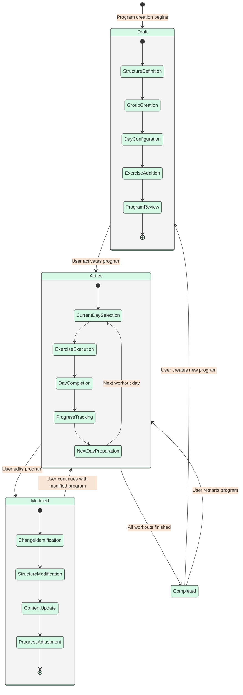

# Workout Program State Diagram

_This document visualizes the core states a workout program can be in throughout its lifecycle in the Meatbag application. It details the transitions between different program states, from creation through completion, and helps clarify how workout programs evolve as users interact with them._

## Overview

The Workout Program State Diagram represents the possible states a workout program can be in within the Meatbag application's MVP. It illustrates how programs transition from being drafted to active, how they can be modified, and how they reach completion based on user actions and progress.

---

## Workout Program States

- **Draft**

  - Initial state for all newly created programs
  - Program structure is being defined
  - User is adding workout groups, days, and exercises
  - Program is not yet ready for execution

- **Active**

  - Program is currently in use
  - User is actively progressing through workout days
  - System is tracking completion of exercises and days
  - Progress metrics are being recorded

- **Modified**

  - Program structure or content is being changed
  - User is updating exercises, days, or groups
  - Changes are being applied to future workouts
  - Past workout data remains unchanged

- **Completed**
  - All workout days in the program have been finished
  - User has successfully progressed through the entire program
  - Final metrics and achievements are calculated
  - Program completion is tracked in user history

---

## Workout Program State Diagram

---

## State Transitions Explanation

### From Draft State

1. **Draft → Active**
   - Triggered when: User completes program setup and activates it
   - Actions: System prepares first workout day, initializes progress tracking
   - System behavior: Transitions program to active execution mode

### From Active State

2. **Active → Modified**

   - Triggered when: User makes changes to active program structure
   - Actions: System applies changes while preserving past progress
   - System behavior: Adapts future workouts to reflect modifications

3. **Active → Completed**
   - Triggered when: User finishes all workout days in the program
   - Actions: Final metrics are calculated, achievements are awarded
   - System behavior: Marks program as successfully completed

### From Modified State

4. **Modified → Active**
   - Triggered when: User continues with program after modifications
   - Actions: System applies changes and resumes progress tracking
   - System behavior: Adapts future workouts based on modifications

### From Completed State

5. **Completed → Draft**

   - Triggered when: User creates a new program after completing one
   - Actions: System creates a new draft program, potentially using the completed one as reference
   - System behavior: Allows creation of a new program structure

6. **Completed → Active**
   - Triggered when: User restarts a previously completed program
   - Actions: System resets progress tracking, prepares first workout
   - System behavior: Begins new execution cycle of the same program

---

## Internal State Processes

### Draft Process

- **Structure Definition**: Basic program parameters are set
- **Group Creation**: Workout groups are added to the program
- **Day Configuration**: Workout days are configured within groups
- **Exercise Addition**: Exercises are added to workout days
- **Program Review**: Complete program structure is reviewed before activation

### Active Process

- **Current Day Selection**: System identifies the current workout day
- **Exercise Execution**: User performs and tracks exercises
- **Day Completion**: All exercises in the day are marked complete
- **Progress Tracking**: System updates overall program progress
- **Next Day Preparation**: System prepares the next workout day

### Modified Process

- **Change Identification**: User identifies aspects to modify
- **Structure Modification**: Changes to program structure are made
- **Content Update**: Exercise details or parameters are updated
- **Progress Adjustment**: System adjusts progress tracking to accommodate changes

---

## Implementation Notes

- The workout program state should be explicitly stored in the database.
- State transitions should be clearly defined in the application logic.
- The system should enforce the completion hierarchy: exercises must be completed for a workout day to be complete, all workout days must be completed for a workout group to be complete, and all workout groups must be completed for a program to be complete.
- The UI should reflect the current program state and available actions.
- Modified programs should maintain consistency with previously completed workouts.

---

## Usage

- Use this state diagram to understand the core states of workout programs in the MVP.
- Refer to it when implementing program management features.
- Ensure all state transitions are properly handled in the application code.
- Consider the user experience implications of each state transition.
- For the complete workout creation process, see the [Workout Creation Flow Diagram](./workout-creation-flow.md).

---

## Future Considerations

- **Paused State**: Add functionality to temporarily pause program progress.
- **Abandoned State**: Implement tracking for programs that users stop using before completion.
- **Archived State**: Add archiving capability for completed programs.
- **Program Templates**: Consider adding a Template state for pre-defined programs.
- **Sharing States**: Add states related to program sharing and collaboration.
- **Version Control**: Implement versioning for programs that undergo significant modifications.
