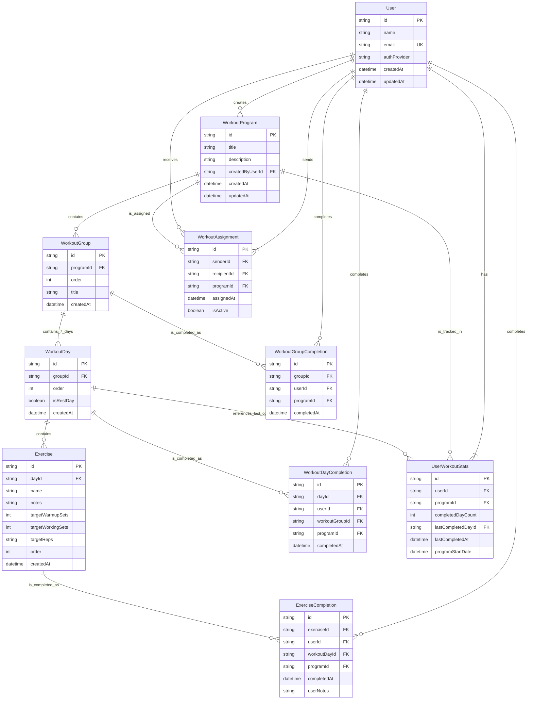

# Entity Relationship Diagram (ERD)

_This diagram and description visualize the main entities, their attributes, and relationships in the Meatbag domain model. The ERD helps clarify how features are built, how entities interact, and is useful for design docs, onboarding, and feature planning._

## Overview

The ERD below represents the core building blocks of the Meatbag workout planning and tracking application. Each entity corresponds to a key concept in the domain model, and relationships show how data and features connect.

---

## Entities & Relationships

- **User**

  - Creates many `WorkoutProgram`s.
  - Can send and receive many `WorkoutAssignment`s.
  - Can have many `ExerciseCompletion`s, `WorkoutDayCompletion`s, and `WorkoutGroupCompletion`s.
  - Has one `UserWorkoutStats` record per `WorkoutProgram` they are following.

- **WorkoutProgram**

  - Is created by one `User`.
  - Contains many `WorkoutGroup`s.
  - Can be referenced in many `WorkoutAssignment`s.
  - Is tracked by one `UserWorkoutStats` record per user following it.

- **WorkoutGroup**

  - Belongs to one `WorkoutProgram`.
  - Contains exactly 7 `WorkoutDay`s.
  - Can have many `WorkoutGroupCompletion`s by users.

- **WorkoutDay**

  - Belongs to one `WorkoutGroup`.
  - Contains many `Exercise`s.
  - Can be marked as a rest day.
  - Can have many `WorkoutDayCompletion`s by users.
  - Can be referenced as the `lastCompletedDayId` in `UserWorkoutStats`.

- **Exercise**

  - Belongs to one `WorkoutDay`.
  - Can have many `ExerciseCompletion`s by users.

- **ExerciseCompletion**

  - Records the completion of one `Exercise`.
  - Is performed by one `User`.
  - Is associated with a specific `WorkoutDay` and `WorkoutProgram`.

- **WorkoutDayCompletion**

  - Records the completion of one `WorkoutDay`.
  - Is performed by one `User`.
  - Is associated with a specific `WorkoutGroup` and `WorkoutProgram`.

- **WorkoutGroupCompletion**

  - Records the completion of one `WorkoutGroup`.
  - Is performed by one `User`.
  - Is associated with a specific `WorkoutProgram`.

- **WorkoutAssignment**

  - Assigns one `WorkoutProgram`.
  - Has one `User` as the `senderId`.
  - Has one `User` as the `recipientId`.
  - Records when the assignment occurred and if it's currently `isActive`.

- **UserWorkoutStats**
  - Belongs to one `User`.
  - Tracks aggregate completion statistics for one `WorkoutProgram` for that user.
  - References the `WorkoutDay` that was last completed.

---

## ERD Diagram (Mermaid Syntax)

---

## ERD Notation Explained

The diagram above uses standard Entity-Relationship Diagram (ERD) notation, specifically tailored for Mermaid syntax. Here's a quick guide to understanding the symbols:

### Entity Blocks

- Each rectangular block represents an **Entity**.
- Inside each entity block:
  - The first line is the **Entity Name**.
  - Subsequent lines list **Attributes** (`attribute_type attribute_name`).
  - `PK`: Denotes a **Primary Key**. This attribute uniquely identifies each record in the entity.
  - `FK`: Denotes a **Foreign Key**. This attribute links to the Primary Key of another entity, establishing a relationship.
  - `UK`: Denotes a **Unique Key**. This attribute must have a unique value for each record, but it's not the primary identifier.

### Relationships

- Lines connecting entities represent **Relationships**. The symbols at each end of the line indicate the **Cardinality** (how many instances of one entity relate to how many instances of another entity).

#### Cardinality Symbols:

- `||`: Exactly one (Mandatory)
- `|o`: Zero or one (Optional)
- `o{`: Zero or many (Optional)
- `|{`: One or many (Mandatory)

#### Common Relationship Types (read from left to right or top to bottom):

- `||--o{` (One-to-Many, Mandatory One to Optional Many): One instance of the first entity relates to zero or many instances of the second entity, and the first entity must exist.
  - Example: `User ||--o{ WorkoutProgram : creates` (A User creates zero or many WorkoutPrograms, and a WorkoutProgram must be created by a User).
- `||--|{` (One-to-Many, Mandatory One to Mandatory Many): One instance of the first entity relates to one or many instances of the second entity, and the first entity must exist.
  - Example: `WorkoutGroup ||--|{ WorkoutDay : contains_7_days` (A WorkoutGroup contains one or many WorkoutDays, specifically 7, and a WorkoutDay must belong to a WorkoutGroup).
- `o--o` (Many-to-Many - not directly shown for the final model but common): Many instances of the first entity relate to many instances of the second entity. This often requires an associative (junction) table in between.

#### Relationship Labels:

- The text after the colon (`:`) on the relationship line provides a verb phrase describing the nature of the relationship (e.g., `creates`, `contains`, `completes`). Underscores `_` are used to represent spaces in the label text as per Mermaid syntax requirements.

---

## Usage

- Use this ERD as a reference for feature design, onboarding, and documentation.
- Update the diagram as the domain model evolves.
- For more detail, see the [Domain Model](./domain-model.md).
